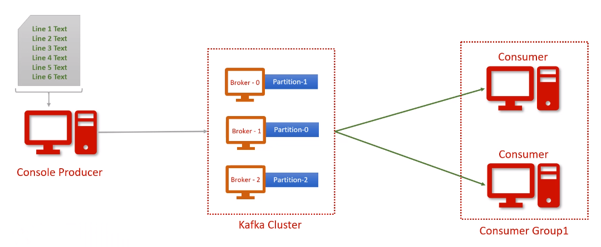
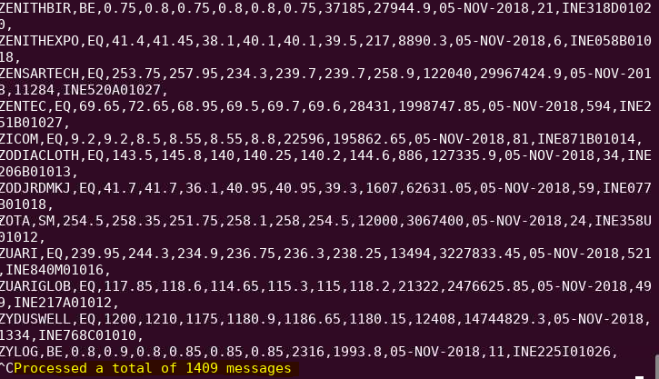
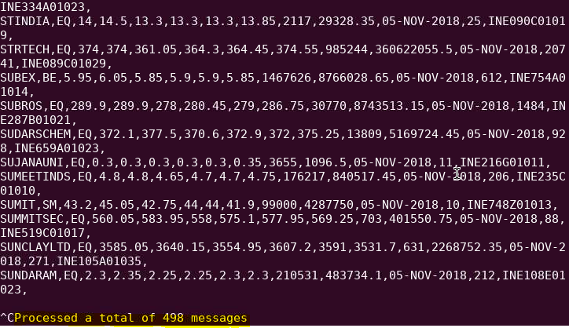
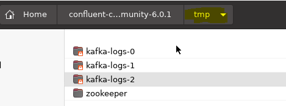
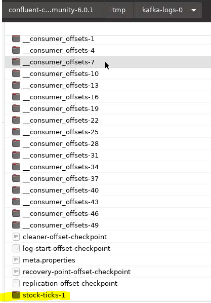
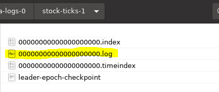
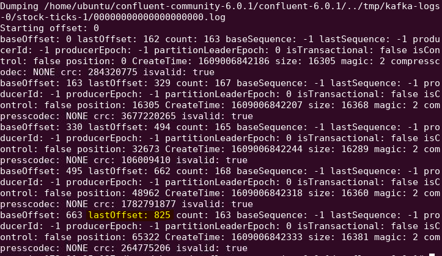
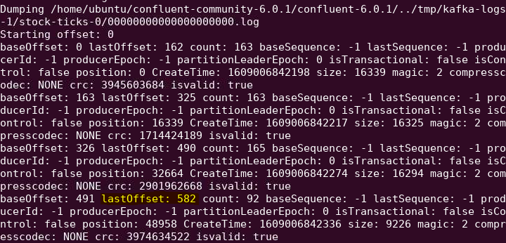
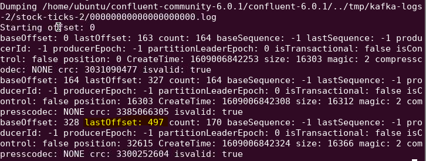
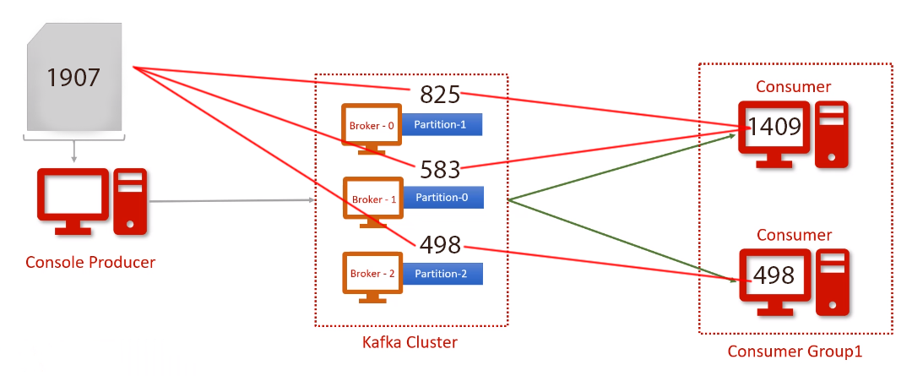

# Kafka Partition and Consumer Group Demo

# Introduction & Goals
- The project was to create a Kafka topic with three partitions, using two consumer groups to read the data. The producer sends a CSV file with 1,907 records.
- The goal was to investigate how many messages each consumer received and how many messages each partition stored. Each paritition was stored on a seperate broker, with a seperate log file.

# The Data Set
- Data type: 
  - CSV file
  - 1,907 rows

# Used Tools
- Kafka
  - Apache Kafka is a distributed message broker. It consists of a Message Producer (Publisher), a Message Broker that will store the messages, and a Message Consumer that will read the messages from the broker.
- How were the tools setup?
  - The Kafka software was downloaded from Confluent.io -- a fully managed Kafka service. This was used to make Kafka easier to install and operate
  - Java was installed on a new AWS EC2 instance (t2.xlarge), on a Ubuntu OS.
  - The Kafka package was manually modified to use three nodes, instead of the default one node.

# Scripts
- // Start Zookeeper
- ./bin/zookeeper-server-start ./etc/kafka/zookeeper.properties

- // Start Kafka Nodes
- ./bin/kafka-server-start ./etc/kafka/server-0.properties
- ./bin/kafka-server-start ./etc/kafka/server-1.properties
- ./bin/kafka-server-start ./etc/kafka/server-2.properties

- // Create topic
- ./bin/kafka-topics --create --topic stock-ticks --partitions 3 --replication-factor 1 --bootstrap-server localhost:9092

- // Start Consumer 1
- ./bin/kafka-console-consumer --bootstrap-server localhost:9092 --topic stock-ticks --from-beginning --group group 1

- // Start Consumer 2 -- same command, new terminal window
- ./bin/kafka-console-consumer --bootstrap-server localhost:9092 --topic stock-ticks --from-beginning --group group 1

- // Send data to topic
- ./bin/kafka-console-producer --topic stock-ticks --broker-list localhost:9092 < ../data/sample1.csv

- //Investigate Log Files # 1
./bin/kafka-dump-log --files $KAFKA_HOME/../tmp/kafka-logs-0/stock-ticks-1/00000000000000000000.log

- //Investigate Log Files # 2
./bin/kafka-dump-log --files $KAFKA_HOME/../tmp/kafka-logs-1/stock-ticks-0/00000000000000000000.log

- //Investigate Log Files # 3
./bin/kafka-dump-log --files $KAFKA_HOME/../tmp/kafka-logs-2/stock-ticks-2/00000000000000000000.log

# Results
- The first consumer group received 1409 records.

- The second consumer group received 498 records.

- When investigating the partition logs, we first navigate to the tmp directory.

- The first log file for stock-ticks-1 shows 825 records in this partition, but is really 826 since the offset starts with 0.

- The second file for stock-ticks-0 shows 583 records.

- The third file for stock-ticks-2 shows 498 records.

- These three log files total up to 1,907 records--which is the exact amount of records contained in our CSV file.

-If you look at the image below, you can see that the second consumer with 498 records, received all of the 498 records from 'Partition-2.' The first consumer with 1409 records received both records from Partition-1 and Partition-0.

# Conclusion
- The kafka cluster stored the data in the data partitions. Each partition is managed by a seperate broker and the actual data sits inside the log files. You can use the kafka-dump-log tool to investigate these files. Consumers can work in a group to share the workload and achieve workload balance.
